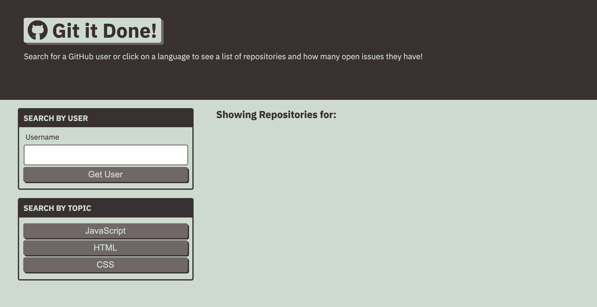

# Git It Done
## Purpose
An application to find open repository issues on GitHub.

## Contents
1. [Features](#features)
2. [Deployed Page](#deployed-page)
3. [Contributions](#contributions)

## Features
* The user can search GitHub by GitHub username.
* The application will then display a list of public repositories for the given GitHub username.
* Repositories with open issues are identified with a red `x` icon, and the number of open issues are displayed.
* Selecting a repository will open a page that lists all of the open issues for that repository.
* The user can search for open GitHub issues by selecting one of the following topics: JavaScript, HTML, or CSS.
* The application is mobile query responsive.

## Deployed Page

[Git It Done! Deployed Page](https://valiantcreative33.github.io/git-it-done/)

## Contributions
* Starter code for basic HTML structure and CSS provided by UCF Coding Boot Camp.
* The rest was created with much captivation by Ruben Matamoros.